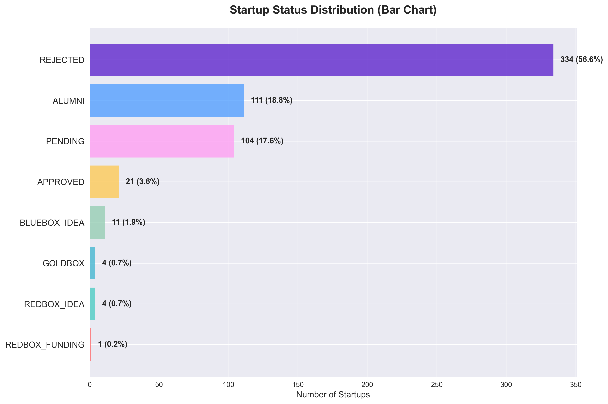
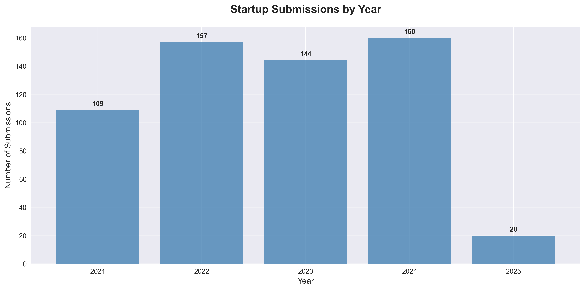
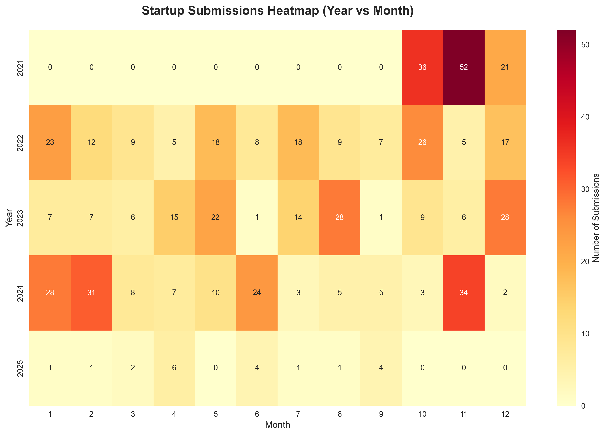
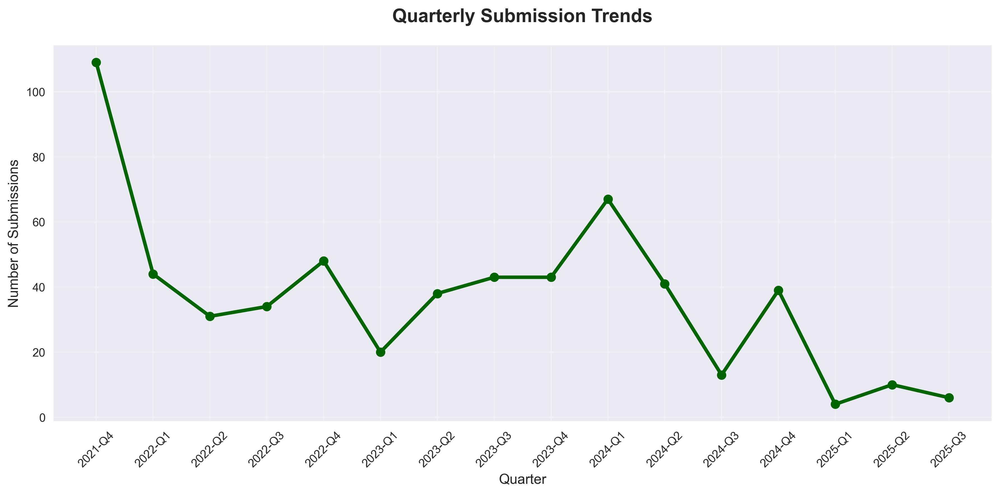
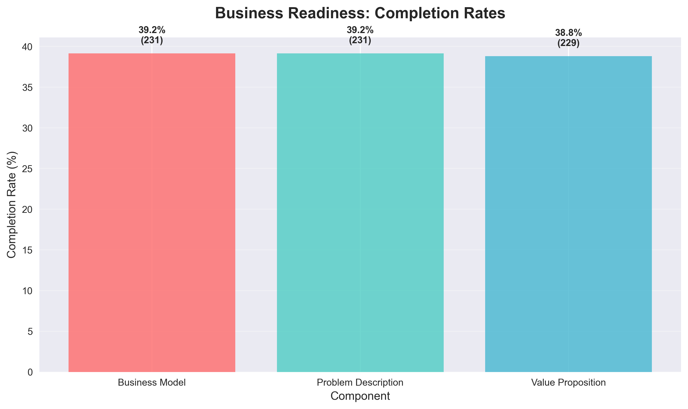
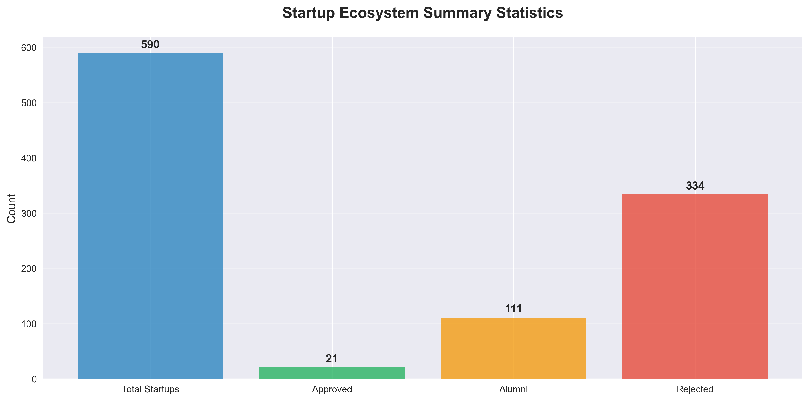

# PASHA Holding Startup Ecosystem Analysis

This repository contains a comprehensive analysis of startup data from PASHA Holding's innovation platform, analyzing **590 startup submissions** from 2021 to 2025.

## Key Findings

**Critical Insights:**
- **Total Startups**: 590 submissions analyzed
- **Approval Rate**: Only 3.6% (21 startups approved)
- **Peak Year**: 2024 with 160 submissions
- **Business Readiness**: Only ~40% provide complete documentation

---

## 1. Status Distribution Analysis



**Key Insights:**
- **56.6% Rejected** (334 startups) - More than half of all submissions
- **18.8% Alumni** (111 startups) - Successfully graduated from program
- **17.6% Pending** (104 startups) - Currently under review
- **3.6% Approved** (21 startups) - Active in current pipeline
- **3.5% Advanced Stages** (20 startups) - In BlueBox, RedBox, GoldBox phases

**Strategic Implication:** The high rejection rate suggests need for better pre-submission guidance and quality control.

---

## 2. Yearly Submission Trends



**Key Insights:**
- **2021**: 109 submissions (partial year start)
- **2022**: 157 submissions (+44% growth)
- **2023**: 144 submissions (-8% decline)
- **2024**: 160 submissions (+11% recovery, peak year)
- **2025**: 20 submissions (partial year)

**Strategic Implication:** Consistent growth trajectory with 2024 showing strongest performance, indicating healthy ecosystem engagement.

---

## 3. Seasonal Patterns



**Key Insights:**
- **Peak Months**: Certain months show consistently higher submission rates
- **Seasonal Variations**: Clear patterns in submission timing across years
- **Strategic Timing**: Understanding these patterns can optimize resource allocation

**Strategic Implication:** Use seasonal insights for campaign planning and resource management.

---

## 4. Quarterly Growth Trends



**Key Insights:**
- **Growth Phases**: Clear quarterly patterns show business cycles
- **Peak Periods**: Certain quarters consistently outperform others
- **Trend Analysis**: Overall upward trajectory with cyclical variations

**Strategic Implication:** Quarterly planning should account for natural submission cycles.

---

## 5. Business Readiness Assessment



**Key Insights:**
- **Business Model**: 39.2% completion rate (231/590)
- **Problem Description**: 39.2% completion rate (231/590)
- **Value Proposition**: 38.8% completion rate (229/590)

**Critical Finding:** Only 4 out of 10 startups provide comprehensive business documentation.

**Strategic Implication:** Major opportunity to improve success rates by requiring complete business documentation before submission.

---

## 6. Overall Ecosystem Health



**Key Insights:**
- **Strong Pipeline**: 590 total submissions show healthy ecosystem
- **Alumni Success**: 111 graduated startups represent valuable network
- **Quality Challenge**: Low approval rate indicates need for better preparation

---

## Strategic Recommendations

### Immediate Actions (0-3 months)
1. **Pre-Submission Templates**: Create mandatory business model, problem statement, and value proposition templates
2. **Quality Gates**: Implement preliminary screening to filter incomplete applications
3. **Alumni Mentorship**: Connect new applicants with 111 alumni for guidance

### Short-term Initiatives (3-12 months)
1. **Success Factor Analysis**: Deep dive into characteristics of approved vs rejected startups
2. **Seasonal Campaigns**: Optimize recruitment timing based on submission patterns
3. **Completion Requirements**: Mandate complete business documentation for review

### Long-term Strategy (12+ months)
1. **Alumni Network Program**: Leverage graduated startups as mentors and case studies
2. **Quality Improvement Initiative**: Target 15%+ approval rate through better preparation
3. **Data-Driven Insights**: Use patterns to predict and improve success rates

---

## Technical Implementation

**Analysis Stack:**
- Python 3 with pandas, matplotlib, seaborn
- Data processing: 590 startup records across 39 attributes
- Visualization: 6 specialized charts with targeted insights
- Time series analysis: 4-year trend analysis (2021-2025)

**Repository Structure:**
```
startup_analyse/
├── README.md                       # This comprehensive analysis
├── ideas.csv                       # Raw startup data (590 records)
├── analysis.py                     # Complete analysis script
├── main_ideas.py                   # Data extraction script
└── assets/
    ├── status_distribution_bars.png
    ├── yearly_submissions.png
    ├── monthly_heatmap.png
    ├── quarterly_trends.png
    ├── business_readiness.png
    ├── summary_statistics.png
    └── startup_insights.txt
```

**Running the Analysis:**
```bash
# Install dependencies
pip install pandas matplotlib seaborn numpy

# Run complete analysis
python analysis.py
```

---

## Key Metrics Summary

| Metric | Value | Insight |
|--------|-------|---------|
| Total Submissions | 590 | Healthy pipeline volume |
| Approval Rate | 3.6% | **Critical**: Too low, needs improvement |
| Alumni Success | 111 startups | Strong graduation network |
| Peak Year | 2024 (160) | Growing ecosystem engagement |
| Documentation Rate | ~40% | **Major gap**: Most lack complete business plans |
| Rejection Rate | 56.6% | Quality control bottleneck |

---

**Analysis Date:** September 17, 2025
**Data Source:** PASHA Holding Innovation Platform
**Analysis Period:** October 2021 - September 2025